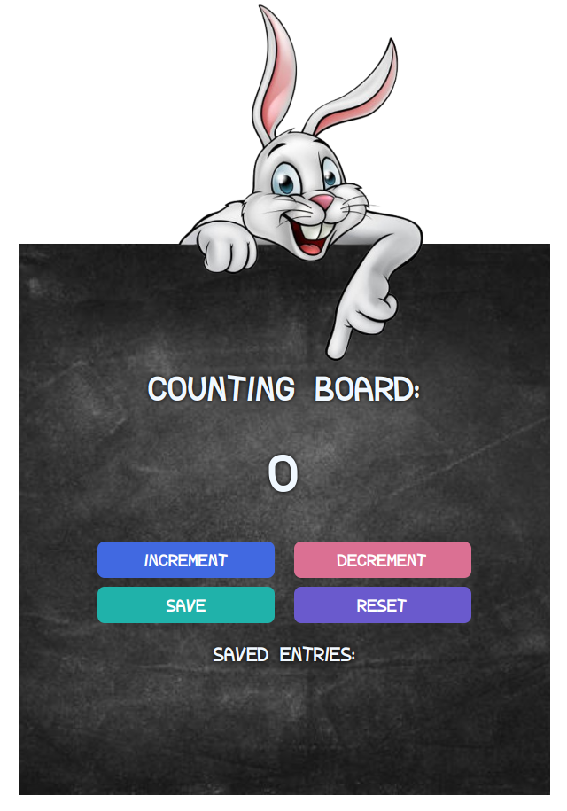

# Counter App

This is a simple JavaScript application that demonstrates a basic counter functionality.
It allows you to increment and decrement a count value, save the count value, and reset the count value.

## Getting Started

To use this application, follow the instructions below:

1. Clone the repository or download the code files.
2. Open the HTML file (`index.html`) in a web browser.

## Usage

The application provides the following features:

- **Increment:** Click the "Increment" button to increase the count value by 1.
- **Decrement:** Click the "Decrement" button to decrease the count value by 1. The count value cannot go below 0.
- **Save:** Click the "Save" button to save the current count value. The saved count values will be displayed below the buttons.
- **Reset:** Click the "Reset" button to set the count value back to 0 and clear the saved count values.

## Code Explanation

The code defines several functions and variables:

- `saveEl` and `countEl` are variables that store references to HTML elements by using their `id` attributes.
- `count` is a variable that holds the current count value, initially set to 0.
- `increment()` is a function that increases the `count` value by 1 and updates the displayed count value in the HTML.
- `decrement()` is a function that decreases the `count` value by 1, if it is greater than 0, and updates the displayed count value in the HTML.
- `save()` is a function that appends the current count value to the saved entries, resets the count value and updates the displayed count value in the HTML.
- `reset()` is a function that sets the count value to 0, clears the saved entries, and updates the displayed count value in the HTML.

## Live link: 🌐

- [app.netlify.com](https://endearing-taffy-248015.netlify.app/)

